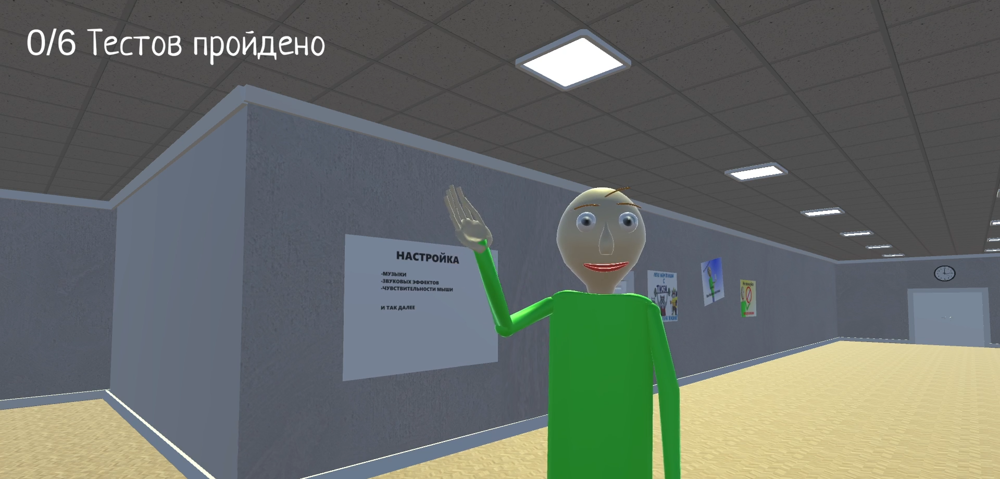
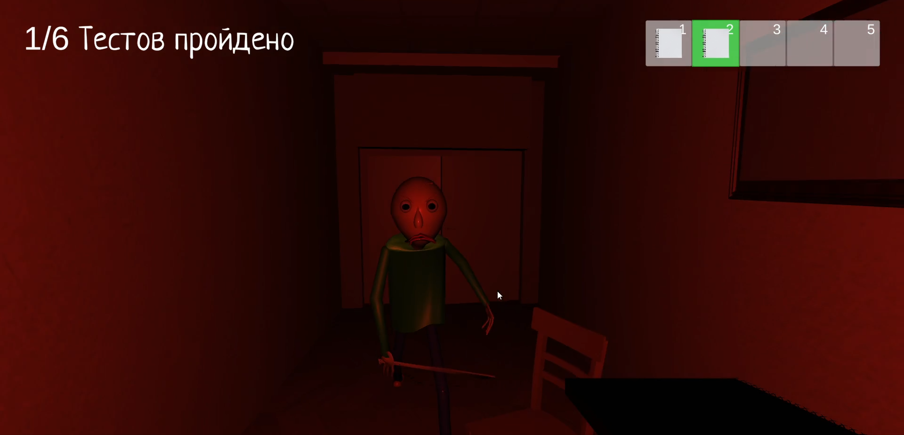
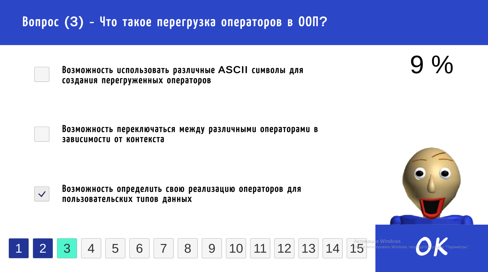
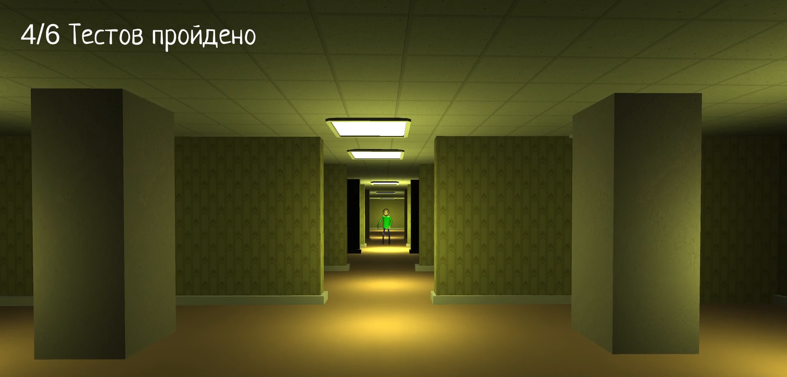
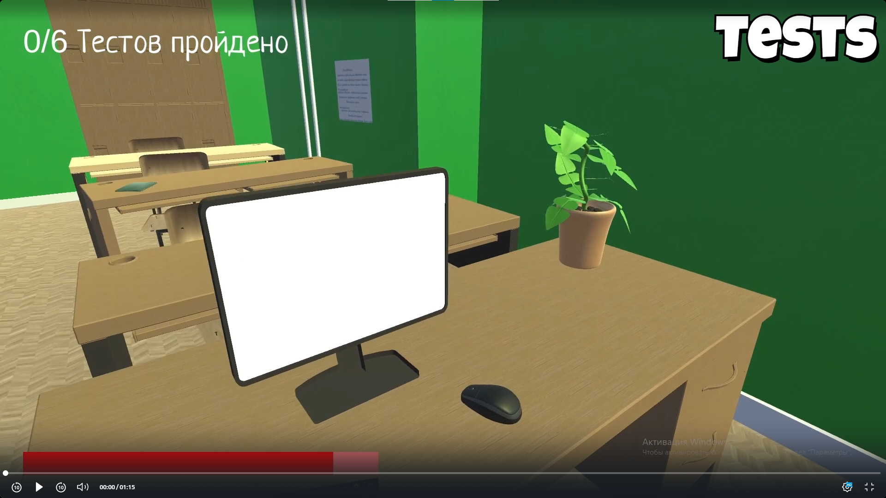

<h1 align="center">Tilbi</h1>

<h3 align="center">A comedy horror action Unity game with elements of an educational simulator, which is a parody of the Baldi game</h3>

	
	
	
	
	

<h2 id="table-of-contents">Table of Contents</h2>
<ul>
    <li><a href="#plot">Plot</a></li>
    <li><a href="#features">Features</a></li>
    <li><a href="#features-demo">Features Demo</a></li>
    <li><a href="#tech-stack">Tech Stack</a></li>
    <li><a href="#project-experience">Project Experience</a></li>
</ul>

<h2 id="plot">Plot</h2>

A student comes to the university to pay his debts. He needs to pass all 6 tests on the subject of object-oriented programming in the context of the C# language.

At the first location, he needs to pass 2 tests, the 2nd of which is intentionally incorrect - it cannot be successfully passed. After his failure, the player finds himself in a second location with an enraged teacher named Tilbi. He's trying to catch up with the main character and hit with a ruler.

The hero must quickly move around the location, find computers to take tests, cheat sheets with answers to test questions and food to replenish the energy spent while running. In addition, the answers to the test questions are scattered throughout the area in the form of papers and pictures.

If the test fails (i.e., if the test passes by less than 60%), the computer is locked for 30 seconds, and Tilbi becomes faster. If the teacher catches up with the student, the game starts all over again.

The atmosphere here is gloomy - there are gloomy sounds, low lighting, the heartbeat of the main character when the teacher approaches, and light screamers. But at the same time, she is funny, she is diluted by NPCs with interesting voice acting, jokes of the main character, references to other games (for example, FNAF) etc.

After successfully passing three tests from the second location, the main character moves to the final one, which simulates Backrooms (an endless maze of randomly interconnected office and utility rooms). In it, the player needs to find computers again and pass two tests without cheat sheets and food, running away from Tilbi.

After successfully passing all the tests, the joyful Tilbi gives the student a credit card =)

<h2 id="features">Features</h2>

- Clear logic of passing the tests.
- Walking, sitting, and talking NPCs.
- Inventory with pick-up items.
- Cheat sheets with answers to test questions.
- Smooth animations.
- Audio: background music, character cues, sounds.
- Three different scenes.
- Sound settings and mouse sensitivity.

<h2 id="features-demo">Features Demo</h2>

<h2 id="tech-stack">Tech Stack</h2>

- Language: C#.
- Engine: Unity.
- Version Control: Git.

<h2 id="project-experience">Project Experience</h2>

In this project I learned how to work with scenes, animations, light, ambient music, GUI etc.

And practised: OOP, inheritence, interfaces, generics, containers, events, Observer design pattern.